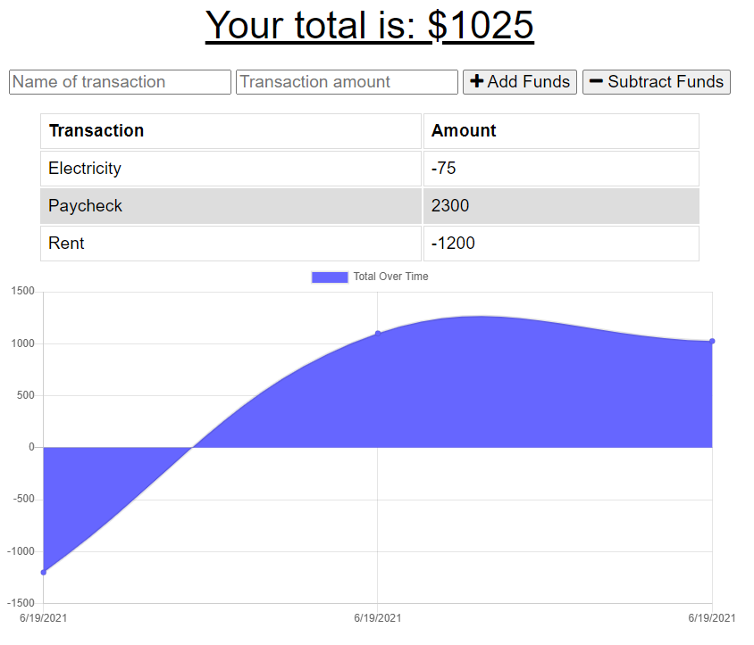

# Budget Tracker (PWA)

## Description

Budget Tracker is a progressive web application that allows users to track their budgets by adding expenses and deposits to their budget through the "Add/Subtract Funds" buttons. They are able to add a transaction with or without a connection. When a user enters a transaction while offline, these transactions are stored in the indexedDB, and transferred to the database when the user comes back online.

## Installation

* Clone the repo

* To install the required dependencies, run `npm i`

## Usage

Start the server by running `npm start` in the CLI. To access the app after starting the server, go to http://localhost:3001 in your browser.

## Example Usage

Deployed App: https://budget-tracker-jm.herokuapp.com/

An example screenshot:

## Questions

If you have any questions, please contact [Josh Mitchell](https://github.com/jshmtchll) directly at jshmtchll@gmail.com.